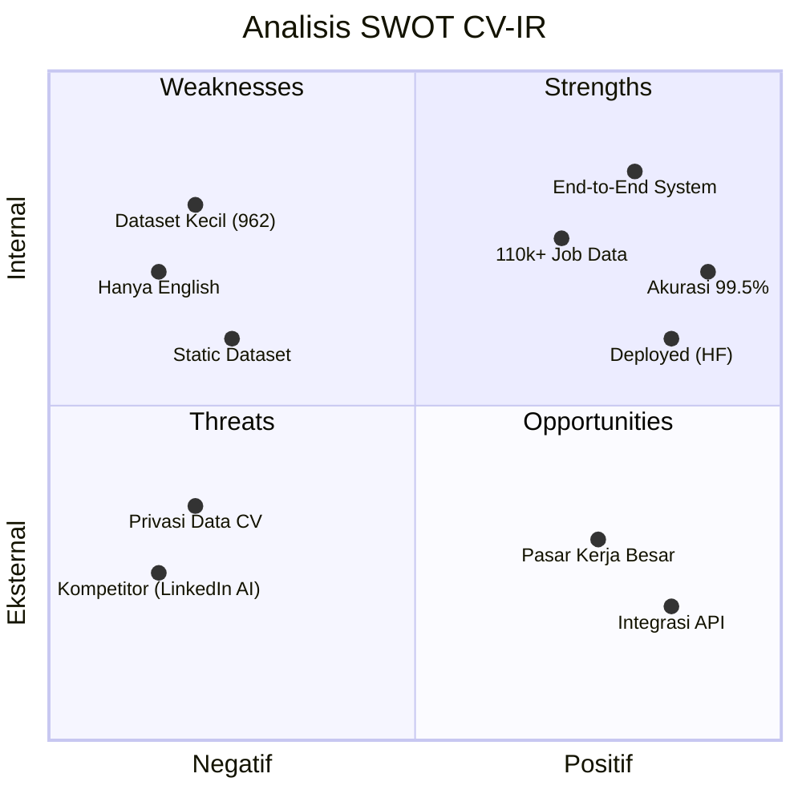

# 📊 Analisis SWOT — CV-Intelligence Recommender (CV-IR)

**Capstone Project PJK-GM075 | Pijak × IBM SkillsBuild**

---

## Matriks SWOT

---

## 💪 Strengths (Kekuatan)

| No | Kekuatan | Penjelasan |
|----|----------|------------|
| 1 | **Sistem End-to-End yang Lengkap** | Proyek ini bukan hanya model ML biasa. Ini adalah **full-stack application** yang mencakup ekstraksi PDF → deteksi skill → prediksi pekerjaan → rekomendasi lowongan → estimasi gaji, semuanya terintegrasi dalam satu aplikasi web |
| 2 | **Akurasi Model Tinggi (99.5%)** | Model Random Forest berhasil mengklasifikasikan 25 kategori pekerjaan dengan akurasi 99.5% pada data testing. Ini menunjukkan bahwa pipeline preprocessing (TF-IDF) dan pemilihan algoritma sudah tepat |
| 3 | **Database Lowongan Besar (110.000+)** | Tidak banyak proyek capstone yang memiliki knowledge base sebesar 110.837 lowongan kerja nyata dari LinkedIn. Ini memberikan variasi rekomendasi yang sangat kaya |
| 4 | **Arsitektur Profesional (Microservice)** | Pemisahan Frontend (Streamlit) dan Backend (FastAPI) mengikuti pola arsitektur **microservice** yang digunakan di industri nyata, bukan monolith sederhana |
| 5 | **Sudah Di-Deploy ke Publik** | Aplikasi sudah bisa diakses siapa saja melalui Hugging Face Spaces, menunjukkan kemampuan tim dalam **deployment dan DevOps** |
| 6 | **Multi-Module NLP** | Menggunakan kombinasi teknik NLP: keyword matching (150+ skill), Named Entity Recognition (spaCy), dan TF-IDF vectorization — bukan hanya satu metode saja |
| 7 | **UI/UX Premium** | Tampilan dark theme dengan gradasi ungu-biru, micro-animations, dan layout responsif menunjukkan perhatian terhadap **user experience**, bukan hanya fungsionalitas |

---

## 😟 Weaknesses (Kelemahan)

| No | Kelemahan | Penjelasan | Dampak |
|----|-----------|------------|--------|
| 1 | **Dataset Training Kecil (962 CV)** | Hanya 962 sampel CV untuk melatih 25 kategori. Rata-rata hanya ~38 CV per kategori. Di industri, dataset minimal ribuan sampel per kategori | Model mungkin kurang generalisasi terhadap CV dunia nyata yang formatnya sangat beragam |
| 2 | **Hanya Mendukung Bahasa Inggris** | Model spaCy (`en_core_web_sm`) dan TF-IDF dilatih hanya dengan teks berbahasa Inggris. Tidak bisa memproses CV berbahasa Indonesia | Pengguna Indonesia yang menulis CV dalam Bahasa Indonesia tidak akan mendapatkan hasil yang akurat |
| 3 | **Dataset Lowongan Statis** | Data 110.000 lowongan LinkedIn berasal dari dataset Kaggle yang di-download sekali. Tidak ada mekanisme pembaruan otomatis | Lowongan yang direkomendasikan mungkin sudah kadaluwarsa atau tidak tersedia lagi |
| 4 | **Kategori Pekerjaan Terbatas (25)** | Hanya mendukung 25 kategori profesi. Profesi seperti "UI/UX Designer", "Product Manager", "Content Writer" tidak tersedia | CV dengan profesi di luar 25 kategori akan diprediksi secara salah (forced classification) |
| 5 | **Estimasi Gaji Berbasis Rule** | Estimasi gaji menggunakan dictionary statis (hardcoded), bukan hasil dari analisis data pasar yang sebenarnya | Angka gaji yang ditampilkan mungkin tidak mencerminkan kondisi pasar terkini |
| 6 | **Tidak Ada Autentikasi User** | Tidak ada sistem login, sehingga tidak bisa menyimpan riwayat analisis CV pengguna | Pengguna harus upload ulang setiap kali ingin menggunakan aplikasi |

---

## 🚀 Opportunities (Peluang)

| No | Peluang | Penjelasan | Potensi Dampak |
|----|---------|------------|----------------|
| 1 | **Pasar Pencari Kerja yang Sangat Besar** | Menurut BPS, ada **~7.9 juta** pengangguran di Indonesia (2024). Platform job matching berbasis AI memiliki pasar yang sangat luas | Jika dikembangkan lebih lanjut, bisa menjadi produk komersial |
| 2 | **Integrasi API LinkedIn/Jobstreet** | Jika menggunakan API lowongan kerja real-time, data tidak lagi statis dan rekomendasi selalu up-to-date | Meningkatkan relevansi dan kegunaan produk secara drastis |
| 3 | **Upgrade ke Model Transformer (BERT/GPT)** | Mengganti TF-IDF + Random Forest dengan model deep learning seperti **IndoBERT** atau **Sentence-BERT** | Akurasi dan kemampuan memahami konteks kalimat meningkat drastis, termasuk mendukung Bahasa Indonesia |
| 4 | **Tren AI di Dunia HR/Recruitment** | Banyak perusahaan HR-tech yang mulai mengadopsi AI untuk screening CV. Proyek ini bisa menjadi fondasi untuk produk SaaS (Software as a Service) | Potensi komersial dan kolaborasi dengan perusahaan rekrutmen |
| 5 | **Fitur Resume Builder** | Menambahkan fitur yang menyarankan perbaikan/penambahan skill di CV berdasarkan gap analysis terhadap lowongan yang diinginkan | Meningkatkan nilai tambah produk dari sekadar "analisis" menjadi "solusi lengkap" |
| 6 | **Mobile App** | Mengembangkan versi mobile (Flutter/React Native) agar pengguna bisa scan CV langsung dari kamera HP | Menjangkau pengguna yang lebih luas, terutama fresh graduate |

---

## ⚠️ Threats (Ancaman)

| No | Ancaman | Penjelasan | Tingkat Risiko |
|----|---------|------------|----------------|
| 1 | **Kompetitor Besar (LinkedIn AI, Jobstreet AI)** | Platform besar seperti LinkedIn sudah memiliki sistem rekomendasi pekerjaan berbasis AI dengan data real-time dan jutaan pengguna | 🔴 Tinggi |
| 2 | **Privasi dan Keamanan Data CV** | CV berisi data pribadi sensitif (nama, alamat, nomor HP). Jika produk ini dikomersialkan, harus memenuhi regulasi perlindungan data (UU PDP Indonesia) | 🔴 Tinggi |
| 3 | **Perubahan Tren Pasar Kerja** | Kategori pekerjaan berubah sangat cepat (misal: munculnya "AI Prompt Engineer" yang belum ada 2 tahun lalu). Model yang dilatih hari ini bisa menjadi usang dalam waktu singkat | 🟡 Sedang |
| 4 | **Ketergantungan pada Dataset Kaggle** | Jika dataset Kaggle dihapus atau berubah lisensinya, proyek kehilangan sumber data utamanya | 🟡 Sedang |
| 5 | **Keterbatasan Hosting Gratis** | Hugging Face Spaces tier gratis memiliki batasan RAM dan CPU. Jika pengguna melonjak, performa bisa menurun drastis | 🟡 Sedang |
| 6 | **Akurasi yang Menyesatkan** | Akurasi 99.5% di dataset Kaggle bisa memberi kesan bahwa sistem ini "sempurna", padahal performanya di dunia nyata bisa berbeda karena distribusi data yang berbeda (*dataset shift*) | 🟡 Sedang |

---

## 🎯 Strategi Tindak Lanjut (SWOT Matrix)

### SO Strategy (Strengths × Opportunities) — Agresif
> Memanfaatkan kekuatan untuk meraih peluang

- Menggunakan arsitektur microservice yang sudah ada sebagai fondasi untuk mengintegrasikan **API lowongan real-time**
- Memanfaatkan akurasi model yang tinggi sebagai *proof of concept* untuk **pitching** ke perusahaan HR-tech

### WO Strategy (Weaknesses × Opportunities) — Perbaikan
> Mengatasi kelemahan untuk meraih peluang

- Menambah dataset CV dengan **data sintetis** atau data dari sumber lain untuk mengatasi keterbatasan 962 sampel
- Upgrade ke **IndoBERT** untuk mendukung CV berbahasa Indonesia dan meningkatkan generalisasi model

### ST Strategy (Strengths × Threats) — Diversifikasi
> Menggunakan kekuatan untuk menghindari ancaman

- Menambahkan fitur **enkripsi dan auto-delete** pada CV yang diupload untuk mengatasi ancaman privasi data
- Memanfaatkan database 110k+ lowongan sebagai keunggulan kompetitif dibanding proyek akademik serupa

### WT Strategy (Weaknesses × Threats) — Defensif
> Meminimalkan kelemahan dan menghindari ancaman

- Menambahkan **disclaimer** yang jelas bahwa estimasi gaji dan rekomendasi bersifat prediksi, bukan jaminan
- Membuat mekanisme **retraining otomatis** agar model tidak menjadi usang ketika tren pekerjaan berubah

---

  <em>Analisis SWOT ini disusun berdasarkan kondisi proyek CV-IR per Juni 2026</em> 
  <strong>Capstone Project PJK-GM075 | Pijak × IBM SkillsBuild</strong>

